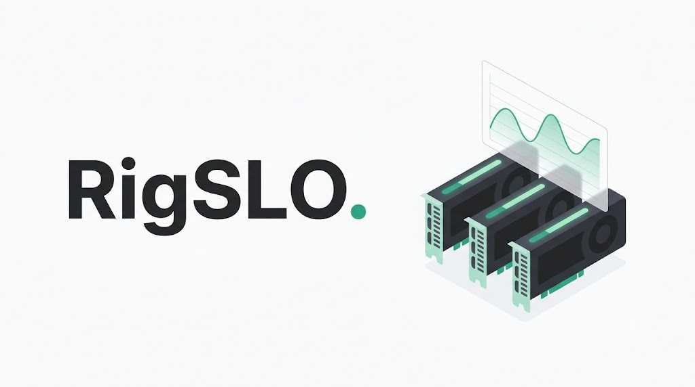
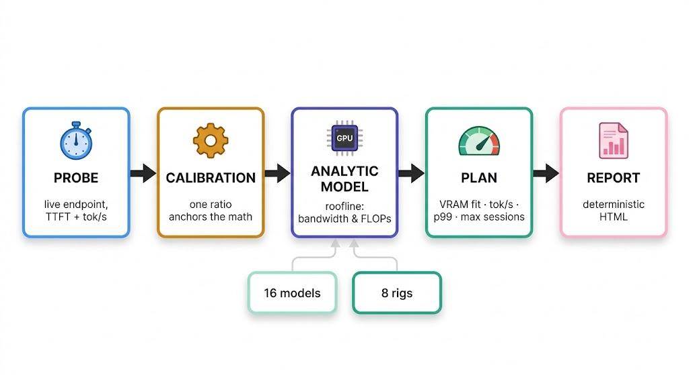
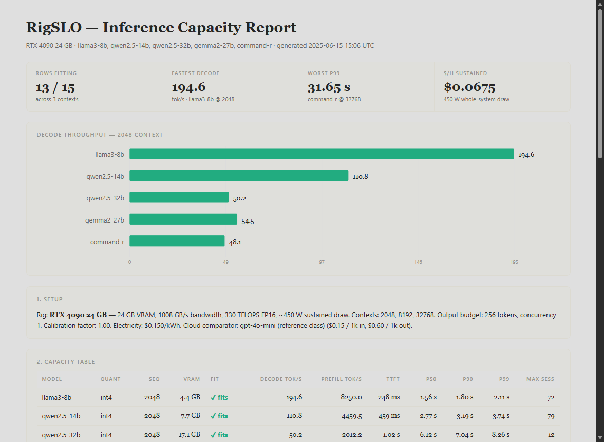
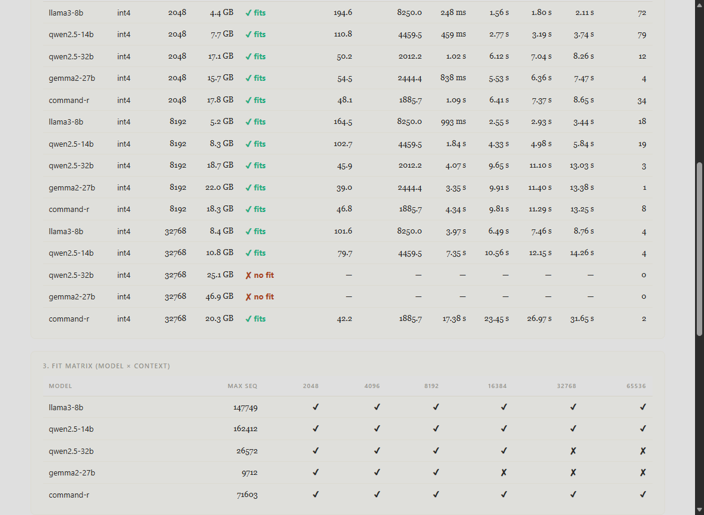
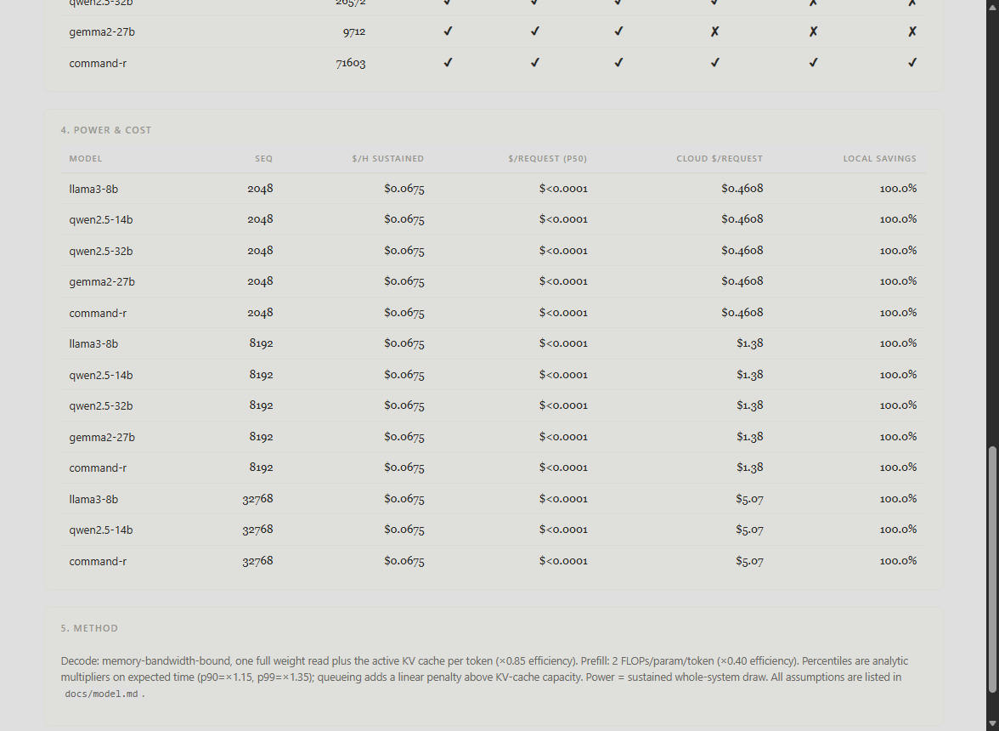

<p align="center">
  
</p>

<h3 align="center">RigSLO — the capacity planner for local LLM inference</h3>

<p align="center">
  
  
  
  
</p>

<p align="center">
  <b>Will it fit? How fast? What SLO? What does it cost in watts and dollars?</b><br>
  RigSLO answers all four — analytically, deterministically, and calibratable
  against your real engine — before you download 30 GB of weights.
</p>

---

## The problem

The local-LLM stack already has tools for **speed** (kernel micro-benchmarks),
**cost per request** (ledgers), and **quality** (eval harnesses). What's
missing is the question you ask *before* any of them:

> *"I have a 24 GB card. Will Llama-3-70B-Q4 actually run it at 8k context?
> What tokens/s should I expect? What p99 latency at 4 concurrent sessions?
> What does an hour of serving cost me in electricity?"*

RigSLO is that planner: a zero-dependency, **deterministic** capacity model
over a built-in catalog of 16 common open models × 8 common rigs, with a live
probe mode that anchors the math to your actual engine.

## Quickstart

```console
$ python -m rigslo plan --rig rtx-4090 --model llama3-8b --quant int4 --seq 8192
model        llama3-8b (int4)
rig          rtx-4090
context      8192 in / 256 out, concurrency 1
vram         5.56 GB  [fits]
decode       148.7 tok/s
prefill      517.9 tok/s
ttft         158 ms
p50 / p90    3.29 s / 3.79 s
p90 / p99    3.79 s / 4.44 s
max sessions 13   queue factor 1.00
throughput   1094.0 requests/h
```

```console
$ python -m rigslo matrix --rig rtx-4090 --models llama3-8b,qwen2.5-32b,command-r,llama3-70b
model               max seq      2048     32768
llama3-8b           147749         ✔         ✔
qwen2.5-32b         26572          ✔         ✘
command-r           12330          ✔         ✘
llama3-70b                  0      ✘         ✘
```

```console
# Multi-model HTML capacity report (Atelier styling, deterministic output)
$ python -m rigslo report --rig rtx-4090 --models llama3-8b,qwen2.5-14b,qwen2.5-32b --seqs 8192,32768 --out report.html
wrote report.html

# Calibrate against a real endpoint (Ollama, vLLM, llama.cpp, LM Studio)
$ python -m rigslo probe --url http://127.0.0.1:8999 --model mock-32b
model            mock-32b
ttft             92 ms
decode           61.3 tok/s
tokens           64 in / 32 out
```

Install (optional — it runs from a checkout): `pip install .` gives you the
`rigslo` command.

## What it models

| Layer | Model | Where the numbers come from |
|---|---|---|
| **VRAM** | weights (quant-aware) + per-sequence KV cache + 128 MiB overhead + 0.5 GB headroom | datasheet architecture values, centralized in `rigslo/models.py` |
| **Decode speed** | memory-bandwidth-bound: `mem_bw / (weights + KV) × 0.85` | roofline, same spirit as kernel micro-benchmarking |
| **Prefill speed** | compute-bound: `tflops / (2 × active_params) × 0.40` | 2 FLOPs/param/token |
| **SLOs** | p50 = analytic expected time; p90 ×1.15; p99 ×1.35 × queue factor | documented constants — challenge one number, not a black box |
| **Concurrency** | `max_sessions` = KV budget ÷ per-sequence KV; linear queue penalty above it | deterministic, no sampling |
| **Power & $** | sustained whole-system watts × $/kWh; cloud reference comparator | `CLOUD_REFERENCE` price class |

Every assumption, constant, and what-is-deliberately-not-modeled list lives
in [`docs/model.md`](docs/model.md).

## Architecture

<p align="center"></p>

A live `probe` measures one fixed request against your real engine; that single
ratio calibrates the analytic roofline model, which runs on two plain-data
catalogs (16 models × 8 rigs). Every number in a plan — VRAM fit, tok/s,
percentiles, max sessions, $/h — flows from the four named formulas above, so
a report is reproducible to the byte.

## Report preview

*Snapped from `examples/demo_report.html` — the demo zoo (5 models × 3 contexts on an RTX 4090) as the `report` command renders it.*







## Deterministic by design

No sampling, no randomness: the same rig + model + flags produce
**byte-identical** output, run to run, machine to machine. CI pins exactly
that property. When you probe a real endpoint, the calibration factor is
the *only* thing that changes the math — and it shows up in the report.

## Calibration

The analytic model is a roofline estimate; your engine is the truth.
`rigslo probe` streams one fixed request and measures TTFT + decode tok/s;
feed the ratio into `plan`/`report` via `--calibration`:

```console
$ python -m rigslo plan --rig rtx-4090 --model qwen2.5-14b --calibration 0.86 --json
```

One probe anchors the whole model. Repeat per quantization if you care.

## Extending the catalogs

Both catalogs are plain data — register your own at runtime (or edit the
module for permanent entries):

```python
from rigslo.models import Model, register
register(Model(
    name="my-local-9b", family="custom",
    params_b=9.0, active_params_b=9.0,
    n_layers=40, n_kv_heads=8, head_dim=128, context=32768,
))
```

## Repository layout

```
rigslo/
  models.py       model catalog + VRAM arithmetic (weights, KV cache, fit)
  rigs.py         rig catalog (VRAM / bandwidth / TFLOPS / watts)
  throughput.py   analytic decode/prefill tok/s (roofline)
  slo.py          Plan: TTFT, p50/p90/p99, max sessions, queueing
  cost.py         kWh/$ arithmetic + cloud reference comparator
  probe.py        live OpenAI-compatible endpoint measurement (streaming)
  report.py       static HTML capacity report (Atelier styling)
  cli.py          plan / matrix / probe / report / export / list-*
tests/            71 tests: arithmetic, boundaries, determinism,
                  probe against a threaded mock server, CLI end-to-end
docs/model.md     every assumption, documented
examples/demo.py  offline demo -> demo_report.html
```

## Design notes

- **Zero runtime dependencies.** `http.server`-class stdlib only — this
  tool is a planning artifact, not a service; it must run anywhere Python
  runs, including the machine you're planning for.
- **Analytic over sampled.** Percentiles are multipliers, not Monte-Carlo —
  reproducible, and each one is a named constant.
- **Honest scope.** Batch compute efficiency, CPU offload, multi-GPU, and
  thermal throttling are *deliberately* out of scope — see the last section
  of `docs/model.md` for where each would plug in.
- **Pairs with the rest of the local-inference stack:** KernelGym measures
  kernel-level speed, TokLedger prices actual traffic; RigSLO tells you what
  to expect *before* either of them has run.

## Testing

```console
$ python -m pytest tests -q
71 passed
```

CI: `.github/workflows/ci.yml` (Python 3.10 + 3.12, pytest + CLI smoke).

## Roadmap

Planned next, in order:

1. **NVML-based rig autodetection** — optional extra, stays zero-dep by default
2. **Multi-GPU aggregate rigs** — tensor/pipeline parallelism
3. **CSV/JSONL catalog imports** — rig + model catalogs from files
4. **Historical calibration store** — probe history → report annotations

## License

MIT — see [LICENSE](LICENSE).

<p align="center"><b>© 2026 Adithya N Raj ✨</b></p>
